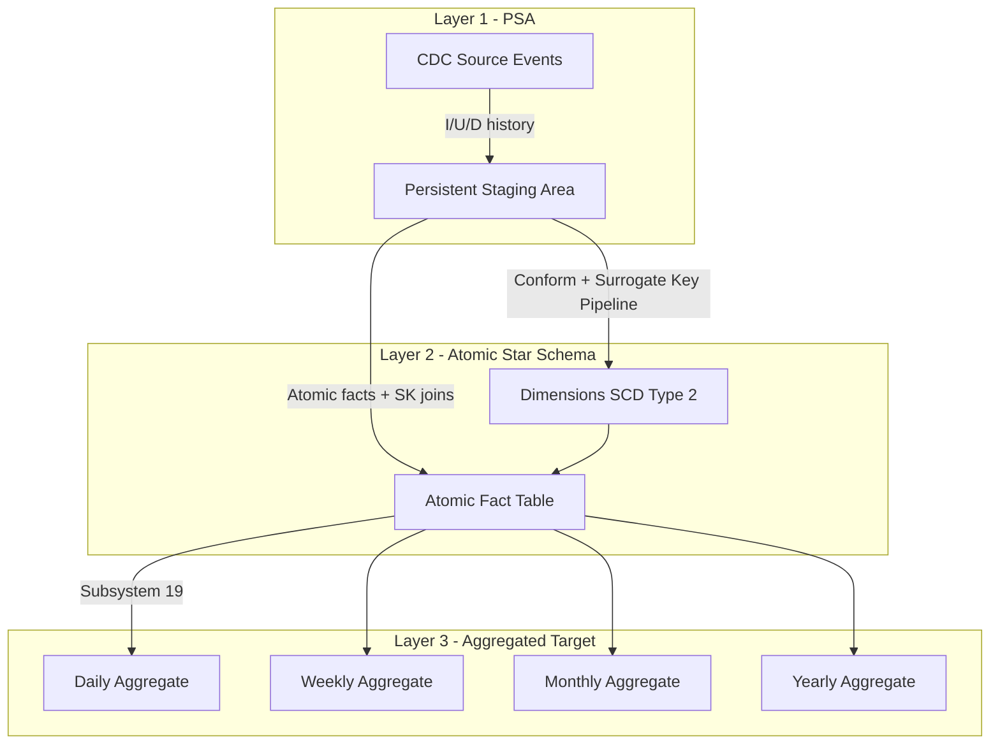
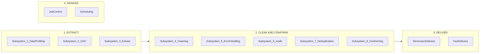
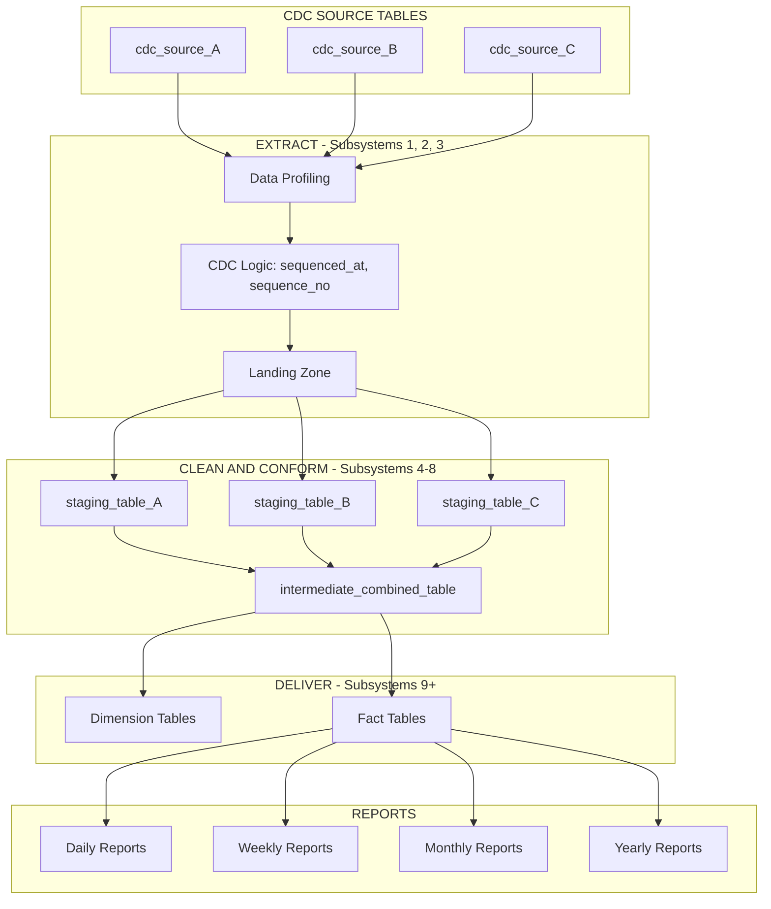
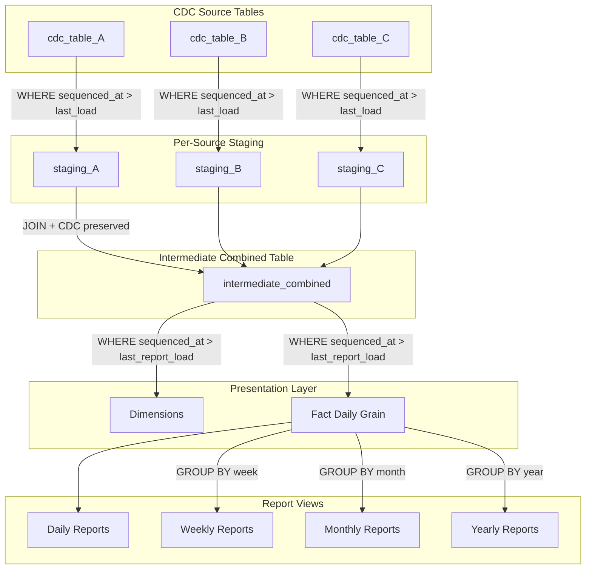
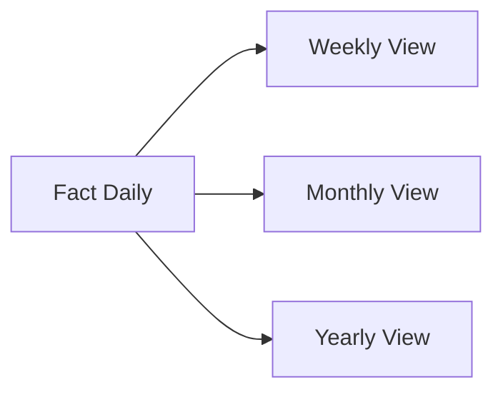

# CDC to Aggregated Target Reports: Data Design and Workflow

**Objective:** Kimball-compliant data warehouse workflow from raw CDC source history to multi-level aggregated reporting (daily, weekly, monthly, yearly), supporting **as-is** (current state) and **as-was** (historical backdated) reporting.

**Reference**: The Data Warehouse Toolkit, 3rd Edition (Wiley, 2013); ETL Architecture's 34 Subsystems (Kimball Group).

---

## 0. Three-Layer Architecture (Summary)

| Layer | Name | Purpose |
|-------|------|---------|
| **1** | Persistent Staging Area (PSA) | Ingest raw CDC events (I/U/D); full history for re-processing and audit |
| **2** | Intermediate Atomic Layer (Star Schema) | Dimensions (SCD Type 2, surrogate + durable key); facts at atomic grain bound to dimension context at event time |
| **3** | Target Aggregated Layer | Subsystem 19: rolled-up tables (daily, weekly, monthly, yearly) as simple sums of atomic layer; single version of truth |

### End-to-End Data Flow



---

## 0.1 Layer 1: Persistent Staging Area (PSA)

- **Ingest**: Raw CDC events (Inserts, Updates, Deletes) from source; preserve `sequenced_at`, `sequence_no`.
- **Full history**: Retain complete source record history for re-processing and auditability.
- **No business logic**: PSA is an immutable, append-friendly copy of CDC stream; cleaning and conforming happen in later layers.

---

## 0.2 Layer 2: Intermediate Atomic Layer (Star Schema)

### Dimensions

- **Primary key**: Sequentially assigned **Surrogate Key** (integer).
- **Durable Supernatural Key**: Business ID from source (e.g. customer_id, product_id) for entity persistence across loads.
- **SCD Type 2**: New row on attribute change; each row has:
  - `row_effective_date`, `row_expiration_date`, `current_row_indicator`.
- **Never use source natural keys as dimension PKs** in the star; surrogate keys only (Surrogate Key Pipelining).

### Fact Tables

- **Grain**: Most granular atomic level captured by the source (e.g. one row per transaction or event).
- **Foreign keys**: Surrogate keys to dimensions only.
- **Binding rule**: Each fact row joins to the dimension **version effective at the time of the event** (enables as-was reporting).
- **Optional SCD Type 7 (Dual Keys)**: Store both dimension Surrogate Key and Durable Supernatural Key in the fact; allows as-is reporting by joining to current-dimension view on durable key.

---

## 0.3 Layer 3: Target Aggregated Layer (Subsystem 19)

- **Subsystem 19 (Aggregate Builder)**: Build rolled-up tables for Daily, Weekly, Monthly, Yearly grains.
- **Logic**: Simple sums (and other additive measures) of the atomic fact table; no derived business rules—single version of truth.
- **Refresh**: On load of atomic facts, incrementally update affected aggregate buckets (or full refresh per high-water mark).

---

## 0.4 Backdated Reporting Strategy

| Mode | Purpose | Join Logic |
|------|---------|------------|
| **As-Was (Historical)** | Report data exactly as it was when the event occurred | Fact joins to dimension via **Surrogate Key**. The SK was assigned when the fact was loaded and points to the dimension row effective at event time. |
| **As-Is (Current)** | Report all history through today's organizational lens | Use **SCD Type 7 (Dual Keys)**. Store durable key in fact; join to a **view of the dimension filtered for current rows only** (current_row_indicator = 1). Same durable key links all historical fact rows to the current dimension profile. |

### Late Arriving Data (Subsystem 16)

- When a fact arrives with an **old event timestamp**, it must join to the dimension **Surrogate Key that was effective at that past time**, not the current one.
- **Subsystem 16 (Late Arriving Data Handler)**: On insert of late-arriving fact, look up dimension by durable key and event date; resolve to the correct historical surrogate key (row where event_date BETWEEN row_effective_date AND row_expiration_date), then insert fact with that SK.

---

## 0.5 Data Integrity Rules

- **Retroactive refresh**: If CDC sends a correction to a historical record, update the **Atomic Fact** table (or dimension if SCD Type 2 change). Trigger **selective refresh** of all affected aggregate buckets (daily/weekly/monthly/yearly) using high-water mark or timestamp logic so aggregates stay in sync.
- **Surrogate key pipelining**: No natural keys from source as primary keys in the star schema; integer surrogate keys only for performance and historical tracking.
- **Conformed dimensions**: Dimensions such as **Date** and **Product** must be identical (same structure and content) across all fact tables to enable **drill-across** reporting between business processes.

---

## 0.6 Implementation Checklist

1. **Atomic Star Schema** – Base layer (dimensions + atomic fact table).
2. **SCD Type 2 + Durable Keys** – Dimension history with row_effective_date, row_expiration_date, current_row_indicator; durable supernatural key on each dimension.
3. **SCD Type 7** – Dual-key fact design (surrogate + durable key) for as-is reporting.
4. **Subsystem 19** – Automated summary rollups (daily, weekly, monthly, yearly).
5. **Subsystem 16** – Late-arriving and retroactive fact handling (assign correct historical dimension SK).

---

## 1. Kimball ETL Data Flow (4 Phases)

Per the Kimball Group, ETL is organized into four major phases:



---

## 2. High-Level Data Flow Diagram



---

## 3. Kimball Subsystems Applied

### Phase 1: Extract (3 Subsystems)

| Subsystem | Name | Purpose |
|-----------|------|---------|
| 1 | Data Profiling | Explore source CDC tables; validate sequenced_at, sequence_no |
| 2 | Change Data Capture | Isolate changes using sequenced_at and sequence_no; reduce ETL burden |
| 3 | Extract System | Extract and move CDC rows into warehouse landing zone |

**Source CDC Tables**: Each has `sequenced_at`, `sequence_no` for point-in-time and incremental reads.

### Phase 2: Clean and Conform (5 Subsystems)

| Subsystem | Name | Purpose |
|-----------|------|---------|
| 4 | Cleansing and Data Quality | Validate, standardize, fix data quality issues |
| 5–6 | Error Event and Audit | Log errors; attach audit dimension for traceability |
| 7 | Deduplication | Resolve duplicates using sequence_no (latest version per business key) |
| 8 | Conforming | Combine multiple staging tables into conformed structures |

**Intermediate Combined Table** lives in the Conforming subsystem (8). It joins multiple per-source staging tables and **maintains CDC** so reports can do incremental reads.

### Phase 3: Deliver (13 Subsystems)

Deliver dimension and fact tables to the presentation/BI layer. Use **Periodic Snapshot** fact tables for daily/weekly/monthly/yearly reporting (Kimball technique: grain = period).

---

## 4. Intermediate Combined Table Design

### Purpose

The intermediate combined table:

- Joins multiple CDC source tables (via their staging equivalents)
- Preserves CDC columns so downstream reports can read incrementally
- Serves as the single source for daily, weekly, monthly, yearly reports

### CDC Propagation

Each row in the intermediate combined table carries CDC metadata:

| Column | Source | Purpose |
|--------|--------|---------|
| `sequenced_at` | MAX of all joined source sequenced_at | When this combined row was last changed |
| `sequence_no` | Derived (e.g., row number within business key) | Ordering for point-in-time queries |
| `source_sequence_metadata` | Optional JSON/columns | Trace back to source CDC rows |

### Kimball Procedure: Multi-Source Combine

From Kimball methodology (incremental load for dimensions from multiple sources):

> Load each source table's changes incrementally into staging, then perform a complete join. Include a combined row if **any** contributing source changed.

**Pattern**:

```sql
-- Intermediate combined table insert/merge
INSERT INTO intermediate_combined_table
SELECT
    {business_keys},
    {conformed_attributes},
    GREATEST(a.sequenced_at, b.sequenced_at, c.sequenced_at) AS sequenced_at,
    ROW_NUMBER() OVER (PARTITION BY {business_key} ORDER BY GREATEST(...) DESC) AS sequence_no
FROM staging_A a
JOIN staging_B b ON a.key = b.key
JOIN staging_C c ON b.key = c.key
WHERE a.sequenced_at > @last_load_ts
   OR b.sequenced_at > @last_load_ts
   OR c.sequenced_at > @last_load_ts;
```

---

## 5. Detailed Data Flow: CDC to Reports



---

## 6. Intermediate Table Schema (CDC Maintained)

```sql
CREATE TABLE intermediate_combined (
    -- Business keys (from joined sources)
    business_key_1 VARCHAR(100),
    business_key_2 VARCHAR(100),

    -- Conformed attributes (from multiple CDC sources)
    attribute_1 VARCHAR(255),
    attribute_2 VARCHAR(255),
    measure_1 DECIMAL(18,2),

    -- CDC columns (maintained for incremental report reads)
    sequenced_at TIMESTAMP_NTZ NOT NULL,
    sequence_no BIGINT NOT NULL,

    -- Optional: source lineage
    source_tables_modified VARCHAR(500)
);

-- For point-in-time report queries
CREATE INDEX idx_intermediate_cdc ON intermediate_combined(business_key_1, sequenced_at DESC, sequence_no DESC);
```

---

## 7. Report Layer: Daily, Weekly, Monthly, Yearly

Per Kimball (Periodic Snapshot Fact Tables):

- **Grain**: One row per period (day, week, month, year) per dimensional context
- **Dense**: Insert rows even when no activity (0/NULL measures)
- **Single lowest grain + views**: Build fact at daily grain; create views for weekly, monthly, yearly



---

## 8. Kimball Book References

- **The Data Warehouse Toolkit, 3rd Ed.**: Chapter on ETL, 34 Subsystems
- **ETL Architecture's 34 Subsystems**: Kimball Group (kimballgroup.com)
- **Subsystem 2 (CDC)**: Isolate changes to reduce processing burden
- **Subsystem 8 (Conforming)**: Combine multiple sources into conformed structures
- **Periodic Snapshot Fact Tables**: Standard technique for daily/weekly/monthly/yearly reporting
